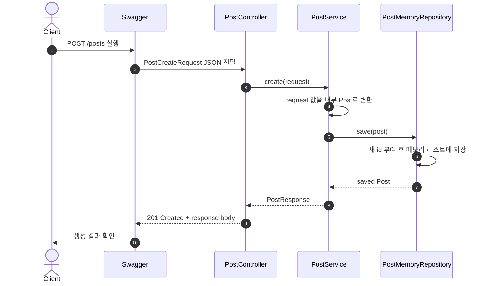
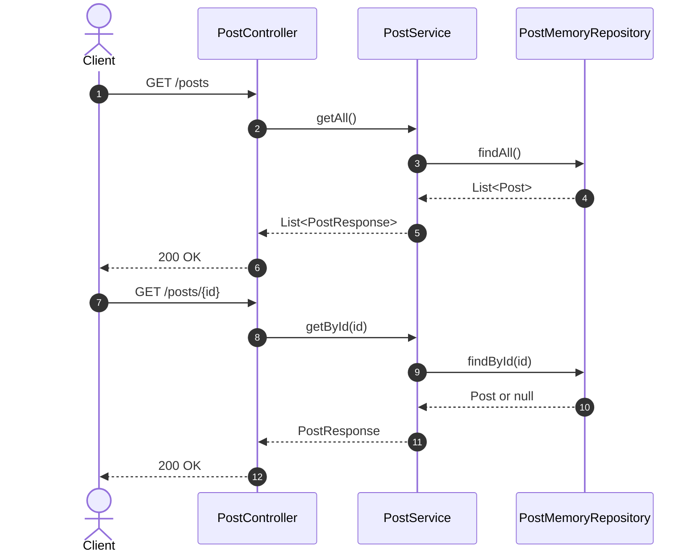
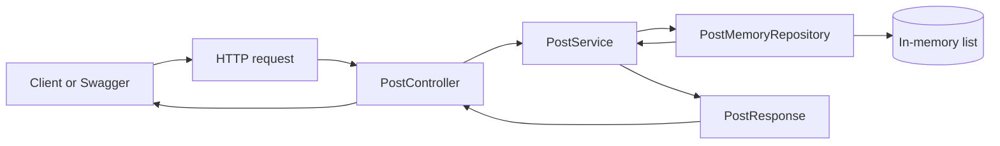

# 이론 정리

> 이번 시퀀스는 Spring Boot에서 HTTP 요청이 Controller로 들어와 Service와 메모리 Repository를 거쳐 Response DTO로 돌아가는 가장 짧은 CRUD 흐름을 다룹니다. DB, JPA, Security, Validation은 이번 범위가 아니며, 요청/응답과 계층 책임을 먼저 잡습니다.

## 1. Problem - 왜 요청/응답 흐름을 먼저 잡아야 하는가

백엔드 코드는 사용자의 HTTP 요청을 받아 처리하고 응답을 돌려주는 흐름으로 시작합니다. 이 흐름을 잡지 못한 상태에서 DB, 인증, 검증을 붙이면 어떤 계층에 무엇을 두어야 하는지 판단하기 어렵습니다.

이번 시퀀스에서는 `POST /posts`, `GET /posts`, `GET /posts/{id}` 세 API만 사용합니다. 저장은 DB가 아니라 메모리 리스트로 처리합니다. 이렇게 범위를 줄이면 Controller, Service, Repository, DTO의 기본 역할을 먼저 분리해서 볼 수 있습니다.

## 2. Analyze - 어떤 책임을 어느 계층에 둘 것인가

처음에는 Controller 안에 요청 처리, 저장, 조회, 응답 변환을 모두 넣을 수도 있습니다. 하지만 그렇게 하면 HTTP 입구와 처리 흐름, 저장 방식, 응답 모양이 한 곳에 섞입니다.

이번 시퀀스에서는 아래 기준으로 책임을 나눕니다.

| 계층 | 맡는 책임 | 맡지 않는 책임 |
|---|---|---|
| Controller | URL, HTTP method, request body, response status를 연결합니다. | 메모리 리스트를 직접 다루지 않습니다. |
| Service | request -> domain -> repository -> response 흐름을 조립합니다. | HTTP annotation을 직접 다루지 않습니다. |
| Repository | 메모리 저장, 전체 조회, 단건 조회를 담당합니다. | API 응답 모양을 결정하지 않습니다. |
| DTO | 외부 요청과 응답의 데이터 모양을 표현합니다. | 내부 저장소의 동작을 갖지 않습니다. |
| Model | 서버 내부에서 다루는 게시글 데이터를 표현합니다. | API 요청/응답 경계를 직접 담당하지 않습니다. |

이 구조를 먼저 잡아두면 다음 시퀀스에서 메모리 저장소를 DB 저장소로 바꿀 때 어느 계층의 책임이 바뀌는지 더 명확하게 볼 수 있습니다.

## 3. API / 실행 시퀀스 다이어그램

### 3.1 게시글 생성 흐름

생성 요청에서 중요한 흐름은 "request body를 받는다", "내부 데이터로 바꾼다", "저장소가 id를 정한다", "응답 DTO로 돌려준다"입니다. Controller는 요청 입구이고 저장 세부 로직은 Service와 Repository 쪽으로 넘깁니다.

### 3.2 조회 흐름

전체 조회와 단건 조회는 같은 계층을 지나지만 입력이 다릅니다. 전체 조회는 id가 필요 없고, 단건 조회는 path variable로 받은 id를 기준으로 저장소에서 값을 찾습니다.

## 4. 계층 / DTO / 메시지 흐름

### 4.1 계층 흐름

| 흐름 | 입력 | 처리 | 출력 |
|---|---|---|---|
| 생성 | `PostCreateRequest` | `PostService.create()`가 내부 `Post`를 만들고 저장합니다. | `PostResponse` |
| 전체 조회 | 없음 | `PostMemoryRepository.findAll()` 결과를 응답 DTO 목록으로 바꿉니다. | `List<PostResponse>` |
| 단건 조회 | path variable `id` | `PostMemoryRepository.findById(id)` 결과를 응답 DTO로 바꿉니다. | `PostResponse` |

### 4.2 DTO와 내부 모델 구분

| 타입 | 위치 | 역할 |
|---|---|---|
| `PostCreateRequest` | API 입력 | 클라이언트가 게시글 생성에 보내는 `title`, `content`, `author`를 담습니다. |
| `Post` | 내부 모델 | 저장소가 다루는 게시글 데이터를 표현합니다. |
| `PostResponse` | API 출력 | 클라이언트에게 돌려줄 게시글 응답 모양을 정리합니다. |

필드가 비슷해 보여도 DTO와 내부 모델을 나누는 이유가 있습니다. 요청/응답 형식은 API 계약이고, 내부 모델은 서버가 처리하기 위한 구조입니다. 다음 시퀀스에서 저장 방식이 바뀌어도 API 응답 모양을 안정적으로 유지하려면 이 경계를 먼저 익혀야 합니다.

## 5. Action - 구현에서 연결할 지점

### 5.1 Response DTO 변환 지점을 확인합니다

`PostResponse`는 내부 `Post`를 외부 응답 모양으로 바꾸는 타입입니다. 구현할 때는 내부 모델을 그대로 반환하지 않고 응답으로 필요한 필드만 옮기는 흐름을 만듭니다.

확인 질문:

- 응답에 필요한 필드가 무엇인가요?
- 내부 `Post`와 외부 `PostResponse`를 구분할 수 있나요?
- 변환 책임이 Controller에 섞이지 않았나요?

### 5.2 메모리 Repository의 역할을 확인합니다

`PostMemoryRepository`는 메모리 리스트에 데이터를 저장하고, 전체 조회와 단건 조회를 제공합니다. 이번 단계의 저장소는 서버가 재시작되면 비워지는 임시 저장소입니다.

확인 질문:

- 새 게시글의 id는 어느 계층에서 정하나요?
- `findAll()`은 내부 리스트를 그대로 노출하지 않도록 다루나요?
- 단건 조회는 어떤 기준으로 게시글을 찾나요?

### 5.3 Service가 흐름을 조립하게 합니다

`PostService`는 request -> domain -> repository -> response 흐름을 연결합니다. Controller가 저장소를 직접 알지 않게 만들고, 저장 결과를 응답 DTO로 바꾸는 경계를 둡니다.

확인 질문:

- Controller가 Repository를 직접 호출하지 않나요?
- Service가 생성, 전체 조회, 단건 조회 흐름을 모두 응답 DTO로 정리하나요?
- 없는 id를 조회했을 때 현재 구현의 한계를 설명할 수 있나요?

### 5.4 Controller는 HTTP 입구로 유지합니다

`PostController`는 `POST /posts`, `GET /posts`, `GET /posts/{id}`를 Service 호출로 연결합니다. 생성 요청은 `201 Created` 응답 상태를 사용합니다.

확인 질문:

- endpoint 경로와 HTTP method가 문서와 일치하나요?
- 생성 API가 request body를 `PostCreateRequest`로 받나요?
- Controller 안에 저장 로직이 들어가 있지는 않나요?

## 6. Result - 무엇을 확인하고 어떤 한계가 남는가

이번 시퀀스를 마치면 다음을 확인합니다.

- `./gradlew test`가 통과합니다.
- Swagger에서 `POST /posts`로 게시글을 생성할 수 있습니다.
- Swagger에서 `GET /posts`와 `GET /posts/{id}`를 실행할 수 있습니다.
- 요청이 Controller, Service, Repository를 지나 Response DTO로 돌아오는 흐름을 설명할 수 있습니다.
- 서버를 재시작하면 메모리 데이터가 사라지는 이유를 설명할 수 있습니다.

남은 한계도 분명합니다. 이 시퀀스는 DB 저장, 입력 검증, 전역 예외 응답, 인증/인가를 다루지 않습니다. 존재하지 않는 id 조회나 빈 문자열 요청 같은 실패 처리는 이후 시퀀스에서 더 안전하게 다룹니다.

## 7. 실무 포인트

- Controller는 HTTP와 가까운 코드로 유지하고, 처리 흐름은 Service로 넘깁니다.
- Service는 "복잡한 로직만 두는 곳"이 아니라 요청 처리 순서를 읽기 좋게 모으는 곳입니다.
- Repository는 저장 기술을 감추는 경계입니다. 이번에는 메모리 리스트지만 다음에는 DB 저장소로 바뀔 수 있습니다.
- DTO를 나누면 API 입력/출력 형식을 내부 모델 변경과 분리할 수 있습니다.
- 메모리 저장소는 흐름 학습에는 좋지만 운영 저장소가 아닙니다. 서버 재시작 후 데이터가 사라지는 것이 정상입니다.

## 8. 용어 정리

`Controller`
: HTTP 요청이 들어오는 입구입니다. URL, method, request body, response status를 연결합니다.

`Service`
: 요청 처리 흐름을 조립하는 계층입니다.

`Repository`
: 데이터를 저장하고 조회하는 계층입니다.

`DTO`
: 계층 사이에서 데이터를 전달하기 위한 객체입니다. 이번 시퀀스에서는 요청 DTO와 응답 DTO를 나눕니다.

`Request DTO`
: 클라이언트가 서버로 보내는 요청 body를 담는 타입입니다.

`Response DTO`
: 서버가 클라이언트로 돌려주는 응답 body를 담는 타입입니다.

`Model`
: 서버 내부에서 다루는 데이터 구조입니다.

`In-memory Repository`
: 애플리케이션 메모리에 데이터를 임시 저장하는 저장소입니다.

`Path Variable`
: URL 경로 일부를 값으로 받는 방식입니다. `GET /posts/{id}`의 `id`가 예시입니다.

`Swagger`
: 브라우저에서 API를 실행하고 요청/응답을 확인할 수 있는 도구입니다.

## 9. 다음 구현으로 연결되는 지점

다음 시퀀스에서는 메모리 저장소를 DB 기반 저장소로 바꿉니다. 이번 단계에서 Controller와 Service, Repository, DTO 경계를 먼저 익혀 두면 저장 방식이 달라져도 요청/응답 흐름을 유지할 수 있습니다.

멘토용 설명 포인트

- 먼저 `POST /posts` 요청이 어느 계층을 지나 응답으로 돌아오는지 말로 설명하게 합니다.
- 힌트는 파일명과 책임 경계까지만 제공하고, 구현 세부를 바로 말하지 않습니다.
- 메모리 저장소의 한계는 "서버 재시작 후 데이터가 사라진다"는 장면으로 설명합니다.
- DB, Validation, Security 질문은 다음 시퀀스 범위로 분리하고 이번에는 요청/응답 계층 흐름에 집중합니다.

