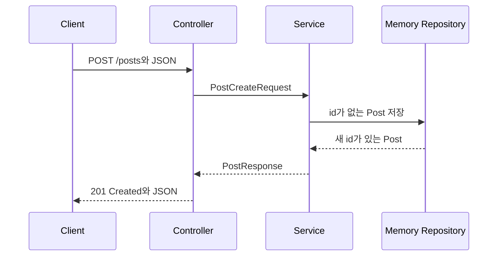

# 요청-응답과 메모리 CRUD 이론 정리

## 1. 요청은 서버 코드의 어디로 들어올까?

브라우저나 Postman에서 `POST /posts`를 보내면 요청은 서버 전체를 한 번에 실행하지 않습니다.
먼저 URL과 HTTP method가 맞는 Controller 함수로 들어옵니다.

이번 시퀀스의 핵심 문제는 "요청이 어느 파일을 지나 응답이 되는가"입니다.
DB, 인증, 예외 처리는 뒤에서 다루고, 여기서는 요청이 들어와 메모리에 저장되고 JSON으로 돌아가는 가장 짧은 흐름만 봅니다.

```text
요청 -> Controller -> Service -> Repository -> Service -> Controller -> 응답
```

이 흐름을 파일 이름으로 설명할 수 있으면 다음 시퀀스에서 저장소가 DB로 바뀌어도 구조를 따라갈 수 있습니다.

## 2. Controller는 왜 직접 저장하지 않을까?

Controller는 요청의 입구입니다.
`POST /posts`, `GET /posts`, `GET /posts/{id}`처럼 외부에서 들어온 주소와 HTTP method를 코드 함수에 연결합니다.

Controller가 저장까지 직접 맡으면 요청 입구와 처리 흐름이 한 파일에 섞입니다.
그래서 이번 코드에서는 `PostController`가 요청을 받고 `PostService`를 호출하는 역할만 맡습니다.

## 3. Service는 무엇을 모을까?

Service는 요청을 처리하는 순서를 모읍니다.
생성 요청에서는 요청 DTO를 내부 데이터인 `Post`로 바꾸고, 저장소에 저장한 뒤, 응답 DTO로 다시 바꿉니다.

핵심은 Service가 "비즈니스라는 큰 단어"를 외우는 곳이 아니라는 점입니다.
지금 단계에서는 요청, 저장, 응답 변환 순서를 한곳에서 읽게 만드는 파일이라고 이해하면 됩니다.

<a id="seq-01"></a>
## 4. Sequence 01: 요청이 메모리 상태와 응답으로 바뀌는 경로

`POST /posts`의 핵심은 파일 이름을 외우는 것이 아니라, 요청 JSON이 `PostCreateRequest -> Post -> 저장된 Post -> PostResponse`로 바뀌는 지점을 찾는 것입니다.
각 계층은 한 번의 상태 변화만 맡으므로 어느 변환에서 값이 달라졌는지 역방향으로 좁힐 수 있습니다.



| 단계 | 들어온 것 | 한 일 | 나간 것 또는 상태 |
| --- | --- | --- | --- |
| 1 | `POST /posts` JSON | Controller가 body를 DTO로 binding | `PostCreateRequest` |
| 2 | 요청 DTO | Service가 내부 데이터로 변환 | id가 `0L`인 `Post` |
| 3 | `Post` | Repository가 새 id를 붙여 list에 추가 | 저장된 `Post` |
| 4 | 저장된 `Post` | Service가 응답 DTO로 변환 | `PostResponse` |
| 5 | 응답 DTO | Controller가 생성 결과를 반환 | `201 Created`와 JSON |

```kotlin
// starter의 Controller TODO: 이 signature에서 Service 호출과 반환을 완성합니다.
@PostMapping
@ResponseStatus(HttpStatus.CREATED)
fun create(@RequestBody request: PostCreateRequest): PostResponse {
    TODO("postService.create(request)를 반환하세요.")
}
```

요청 body는 처리되지 않은 JSON에서 Service가 다룰 수 있는 `PostCreateRequest` 상태로 바뀝니다.

```kotlin
// starter의 Service TODO: request -> Post -> save -> PostResponse 순서를 구현합니다.
fun create(request: PostCreateRequest): PostResponse {
    TODO("request -> Post -> save -> PostResponse 흐름을 완성하세요.")
}
```

임시 id를 가진 요청 데이터는 저장소가 확정한 id를 포함하는 응답 데이터로 바뀝니다.

```kotlin
// starter의 Repository TODO: 새 id를 붙인 Post를 list에 남겨야 합니다.
fun save(post: Post): Post {
    TODO("메모리 리스트에 새 Post를 저장하고 반환하세요.")
}
```

메모리 list에 없던 게시글이 새 id로 식별되는 저장 상태가 됩니다.

[Visual Lab에서 입력 조건을 보고 경로 예측하기](./visual-lab/sequences/01/)

## 5. Repository는 왜 메모리로 시작할까?

처음부터 DB를 붙이면 요청 흐름보다 DB 설정과 SQL, JPA 개념이 먼저 보입니다.
이번 시퀀스는 요청-응답 구조가 목표이므로 `PostMemoryRepository`가 애플리케이션 안의 리스트에 데이터를 잠깐 저장합니다.

메모리 저장소는 서버가 켜져 있는 동안만 데이터를 보관합니다.
서버를 재시작하면 리스트가 새로 만들어지므로 이전 데이터는 사라집니다.

## 6. DTO는 왜 나눌까?

클라이언트가 보내는 JSON 모양과 서버 안에서 다루는 데이터 모양은 같을 수도 있지만, 같은 책임은 아닙니다.

- `PostCreateRequest`: 생성 요청에서 받는 값입니다.
- `PostResponse`: 응답으로 돌려줄 값입니다.
- `Post`: 서버 안에서 저장소와 Service가 다루는 값입니다.

이렇게 나누면 요청 형식, 내부 처리, 응답 형식을 각각 바꿔도 영향 범위를 더 쉽게 찾을 수 있습니다.

## 7. Swagger와 테스트에서 무엇을 확인할까?

`./gradlew bootRun`으로 서버를 실행한 뒤 Swagger에서 `POST /posts`, `GET /posts`, `GET /posts/{id}`를 확인합니다.
`./gradlew test`는 Spring context가 올라오는지와 기본 흐름이 깨지지 않았는지 확인합니다.

## 8. 프로세스를 다시 시작하면 상태가 사라집니다

이번 저장소는 메모리 리스트를 사용하므로 서버를 재시작하면 데이터가 사라집니다.
다음 시퀀스에서는 Repository가 DB 저장소와 연결되고, Entity 기준으로 영속 저장을 다룹니다.

## 9. 오늘 확인할 질문

- `POST /posts` 요청은 어떤 파일을 지나 저장되나요?
- `GET /posts/{id}`에서 `{id}`는 어느 함수로 전달되나요?
- Controller가 Repository를 직접 부르지 않는 이유는 무엇인가요?
- 서버를 재시작하면 메모리 데이터가 사라지는 이유는 무엇인가요?
- Swagger에서 보이는 JSON은 어떤 DTO와 연결되나요?
