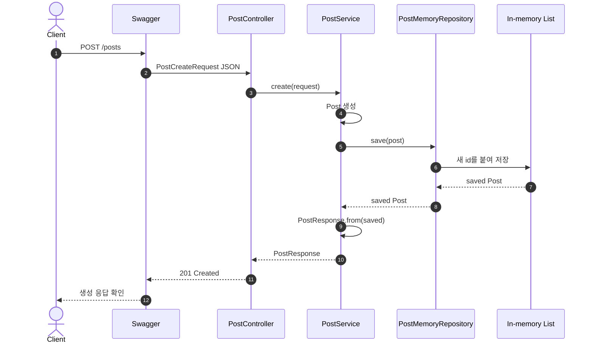
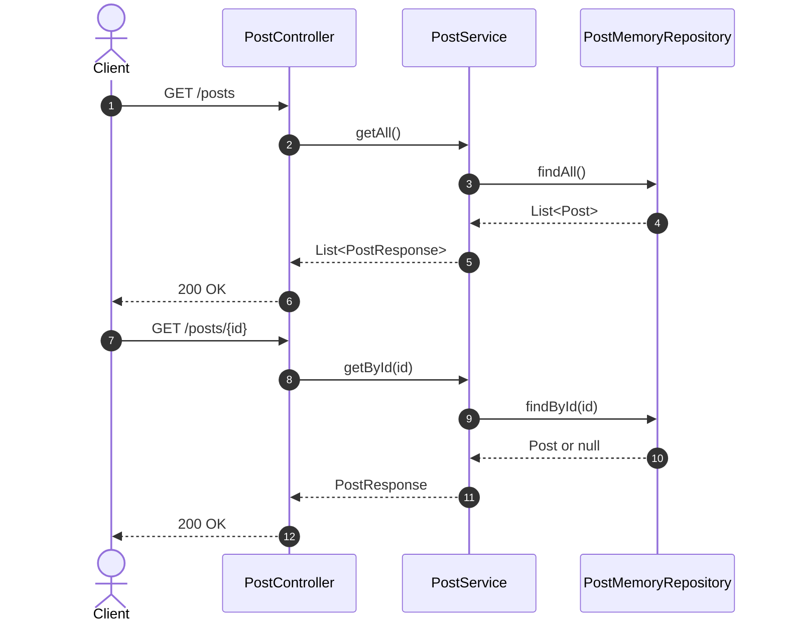
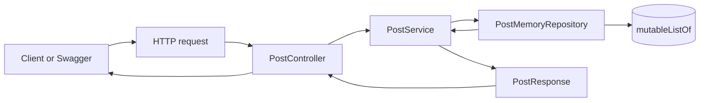

# 이론 정리

> 이 문서는 참고 구현을 기준으로 `POST /posts`, `GET /posts`, `GET /posts/{id}`가 Controller, Service, 메모리 Repository, DTO를 거쳐 동작하는 흐름을 설명합니다. DB, JPA, Security, Validation은 이번 시퀀스의 직접 구현 범위가 아닙니다.

## 1. Problem - 왜 요청/응답 흐름을 먼저 잡아야 하는가

백엔드 입문에서 가장 먼저 필요한 것은 요청이 들어와 응답으로 나가기까지의 흐름을 설명하는 능력입니다. 이 흐름이 잡히지 않으면 DB 저장, 입력 검증, 인증을 붙일 때 어떤 계층이 어떤 책임을 맡아야 하는지 판단하기 어렵습니다.

참고 구현은 게시글 생성, 전체 조회, 단건 조회만 다룹니다. 저장은 메모리 리스트로 처리하며, 목적은 CRUD 기능을 많이 만드는 것이 아니라 Controller, Service, Repository, DTO의 책임을 분리해서 읽는 것입니다.

## 2. Analyze - 참고 구현에서 선택한 구조 기준

Controller 안에서 모든 일을 처리하면 코드가 짧아 보일 수 있습니다. 하지만 HTTP 입구, 처리 흐름, 저장 방식, 응답 변환이 섞이면 다음 단계에서 저장소를 바꾸거나 실패 응답을 정리할 때 변경 지점이 흐려집니다.

| 계층 | 참고 구현의 책임 | 리뷰할 지점 |
|---|---|---|
| `PostController` | endpoint와 HTTP 상태를 Service 호출에 연결합니다. | 저장 로직을 직접 갖지 않는지 봅니다. |
| `PostService` | request -> `Post` -> repository -> response 흐름을 조립합니다. | DTO 변환과 저장 호출 경계가 분명한지 봅니다. |
| `PostMemoryRepository` | 메모리 리스트에 저장하고 id로 조회합니다. | 새 id 부여와 목록 반환 방식을 봅니다. |
| `PostCreateRequest` | 생성 요청 body를 표현합니다. | API 입력과 내부 모델이 분리되는지 봅니다. |
| `PostResponse` | 응답 body를 표현합니다. | 내부 `Post`를 그대로 노출하지 않고 변환하는지 봅니다. |

이번 구현은 최소 성공 흐름입니다. 존재하지 않는 id 조회, 입력 검증, 전역 예외 응답은 이후 시퀀스에서 보강할 한계로 남깁니다.

## 3. API / 실행 시퀀스 다이어그램

### 3.1 게시글 생성 흐름

생성 흐름에서 id는 요청 body에서 오는 값이 아니라 저장소가 새로 부여하는 값입니다. Service는 저장 전 내부 `Post`를 만들고, 저장 결과를 `PostResponse`로 바꿔 Controller에 돌려줍니다.

### 3.2 전체 조회와 단건 조회 흐름

전체 조회는 현재 메모리에 저장된 목록을 응답 DTO 목록으로 바꿉니다. 단건 조회는 path variable로 받은 id를 저장소 조회 기준으로 사용합니다.

## 4. 계층 / DTO / 메시지 흐름

### 4.1 계층 흐름

| 흐름 | 참고 구현의 입력 | 내부 처리 | 참고 구현의 출력 |
|---|---|---|---|
| 생성 | `PostCreateRequest` | `Post` 생성 후 `save()` 호출 | `PostResponse` |
| 전체 조회 | 없음 | `findAll()` 결과를 `map(PostResponse::from)`으로 변환 | `List<PostResponse>` |
| 단건 조회 | path variable `id` | `findById(id)` 결과를 응답 DTO로 변환 | `PostResponse` |

### 4.2 DTO와 내부 모델 구분

| 타입 | 경계 | 참고 구현에서의 의미 |
|---|---|---|
| `PostCreateRequest` | API 입력 | 클라이언트가 보낸 `title`, `content`, `author`를 담습니다. |
| `Post` | 내부 모델 | 저장소가 다루는 게시글 데이터입니다. |
| `PostResponse` | API 출력 | 클라이언트에게 돌려줄 게시글 응답입니다. |

필드가 같아 보여도 이 타입들을 나눠 보는 것이 중요합니다. API 입력/출력은 클라이언트와의 약속이고, 내부 모델은 서버 안에서 처리하기 위한 구조입니다.

## 5. Action - 참고 구현에서 비교할 코드 흐름

### 5.1 `PostResponse.from(...)`의 책임

응답 변환은 내부 `Post`를 외부 응답 모양으로 바꾸는 지점입니다. 이 변환이 있으면 Service는 저장 결과를 API 응답에 맞게 정리해서 Controller로 돌려줄 수 있습니다.

리뷰 질문:

- `Post`와 `PostResponse`를 구분해서 설명하나요?
- 응답 변환이 Controller에 흩어져 있지 않나요?
- 응답 필드가 API 문서와 맞나요?

### 5.2 `PostMemoryRepository`의 책임

메모리 저장소는 새 id를 부여하고, 현재 리스트를 기준으로 전체 조회와 단건 조회를 제공합니다. `findAll()`은 내부 리스트를 그대로 넘기기보다 복사된 목록을 반환해 외부 변경 가능성을 줄입니다.

리뷰 질문:

- id는 요청 값이 아니라 저장소가 부여한다는 점을 설명하나요?
- 서버를 재시작하면 데이터가 사라지는 이유를 설명하나요?
- 저장소가 응답 DTO를 직접 만들지 않나요?

### 5.3 `PostService`의 책임

Service는 request -> domain -> repository -> response 흐름을 연결합니다. 생성에서는 요청 DTO를 내부 `Post`로 바꾸고, 저장 결과를 응답 DTO로 변환합니다. 조회에서는 저장소 결과를 응답 DTO로 바꿉니다.

리뷰 질문:

- Controller가 Repository를 직접 알지 않나요?
- Service 메서드의 반환 타입이 API 응답에 맞게 정리되어 있나요?
- 존재하지 않는 id 조회가 현재 구현의 한계라는 점을 설명하나요?

### 5.4 `PostController`의 책임

Controller는 `@RequestMapping("/posts")`, `@PostMapping`, `@GetMapping`, `@PathVariable`, `@RequestBody`, `@ResponseStatus`처럼 HTTP와 가까운 선언을 담당합니다. 처리 흐름은 Service에 위임합니다.

리뷰 질문:

- `POST /posts`가 `201 Created`를 반환하나요?
- `GET /posts/{id}`의 `id`가 path variable로 전달되나요?
- Controller가 HTTP 입구 역할에 집중하나요?

## 6. Result - 확인할 결과와 남은 한계

완료 후에는 다음을 확인합니다.

- `./gradlew test`가 통과합니다.
- Swagger에서 `POST /posts` 생성 응답을 확인합니다.
- Swagger에서 `GET /posts`와 `GET /posts/{id}` 조회 응답을 확인합니다.
- 요청 -> Controller -> Service -> Repository -> Response DTO 흐름을 설명합니다.
- 메모리 저장소라서 서버 재시작 후 데이터가 사라진다는 점을 설명합니다.

남은 한계는 다음 시퀀스와 연결됩니다. 이번 구현은 DB 저장, Validation, 전역 예외 응답, 인증/인가를 다루지 않습니다. 특히 존재하지 않는 id 조회와 빈 문자열 입력은 이후 시퀀스에서 더 안전하게 다룹니다.

## 7. 실무 포인트

- Controller는 HTTP 요청과 응답 상태를 표현하는 계층으로 유지합니다.
- Service는 계층 사이의 처리 순서를 읽기 좋게 조립합니다.
- Repository는 저장 기술의 경계입니다. 이번에는 메모리 리스트지만 다음에는 DB로 바뀔 수 있습니다.
- DTO와 내부 모델을 나누면 API 계약을 내부 구현 변화로부터 분리할 수 있습니다.
- 메모리 저장소는 학습용으로 빠르지만 운영 저장소가 아닙니다. 서버 재시작 후 데이터가 사라지는 한계를 항상 설명합니다.

## 8. 용어 정리

`Controller`
: HTTP 요청이 들어오는 입구입니다. URL, method, request body, response status를 연결합니다.

`Service`
: 요청 처리 흐름을 조립하는 계층입니다.

`Repository`
: 데이터를 저장하고 조회하는 계층입니다.

`DTO`
: 계층 사이에서 데이터를 전달하기 위한 객체입니다.

`Request DTO`
: 클라이언트 요청 body를 담는 타입입니다.

`Response DTO`
: 클라이언트에게 돌려줄 응답 body를 담는 타입입니다.

`Model`
: 서버 내부 처리에 사용하는 데이터 구조입니다.

`In-memory Repository`
: 애플리케이션 메모리에 데이터를 임시 저장하는 저장소입니다.

`Path Variable`
: URL 경로의 일부를 값으로 받는 방식입니다. `GET /posts/{id}`의 `id`가 예시입니다.

`Swagger`
: 브라우저에서 API를 실행하고 요청/응답을 확인할 수 있는 도구입니다.

## 9. 다음 구현으로 연결되는 지점

다음 시퀀스에서는 메모리 저장소를 DB/JPA 기반 저장소로 바꿉니다. 이번 시퀀스에서 계층과 DTO 경계를 분리해 두면 저장 방식이 바뀌어도 Controller의 요청 입구와 응답 모양은 더 안정적으로 유지됩니다.

멘토용 설명 포인트

- 코드 비교 전 `POST /posts` 흐름을 멘티가 먼저 말로 설명하게 합니다.
- id가 request에서 온 값인지 저장소에서 부여된 값인지 질문합니다.
- `PostResponse.from(...)`은 암기 대상이 아니라 내부 모델과 응답 DTO를 분리하는 지점으로 설명합니다.
- DB, Validation, Security 질문은 다음 시퀀스 범위로 분리하고, 이번에는 요청/응답과 메모리 저장 흐름에 집중합니다.

